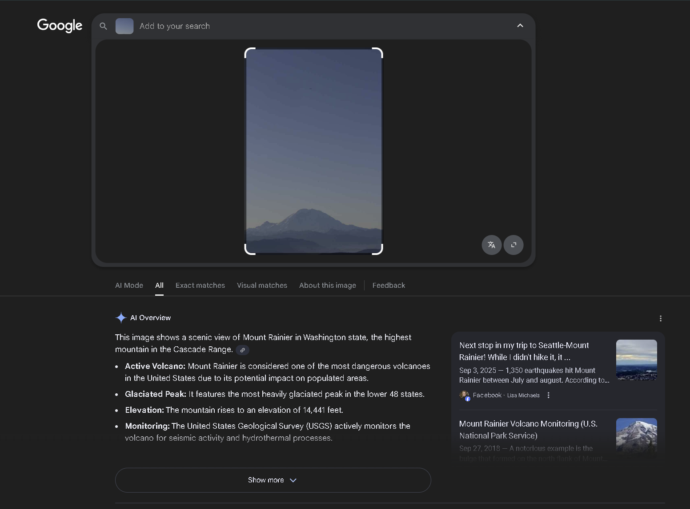
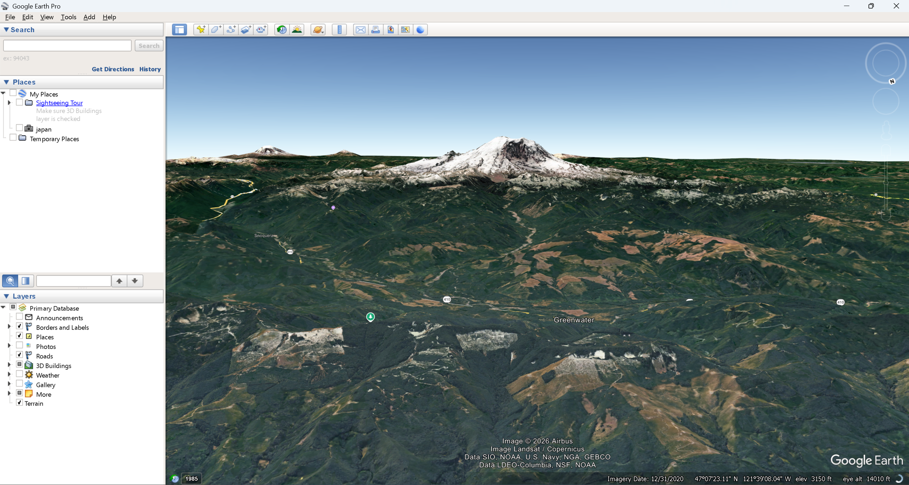
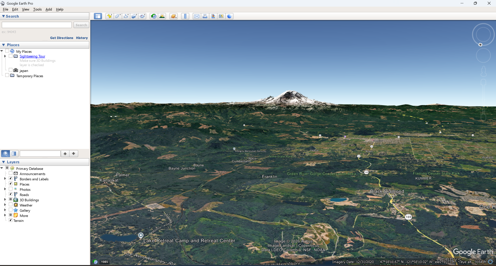
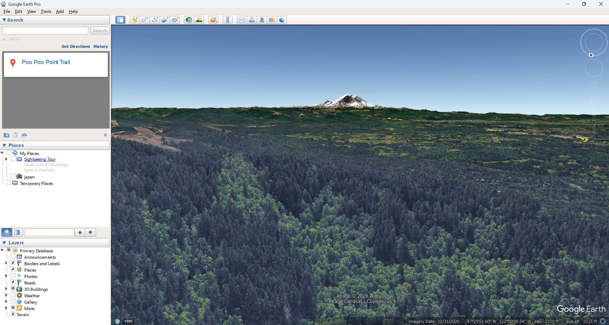
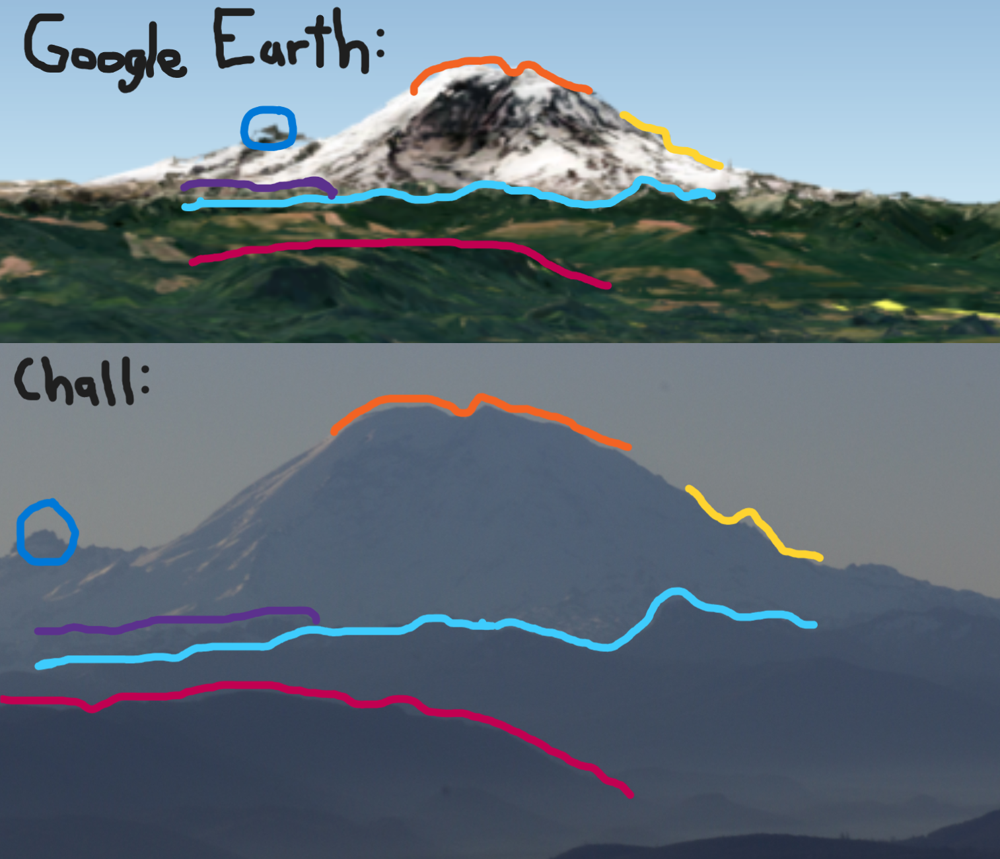
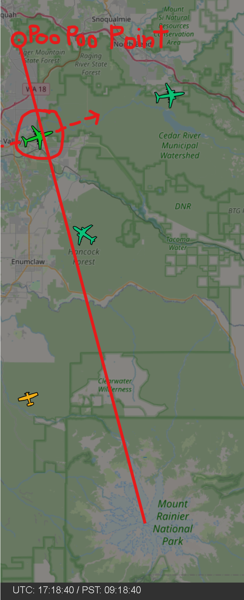
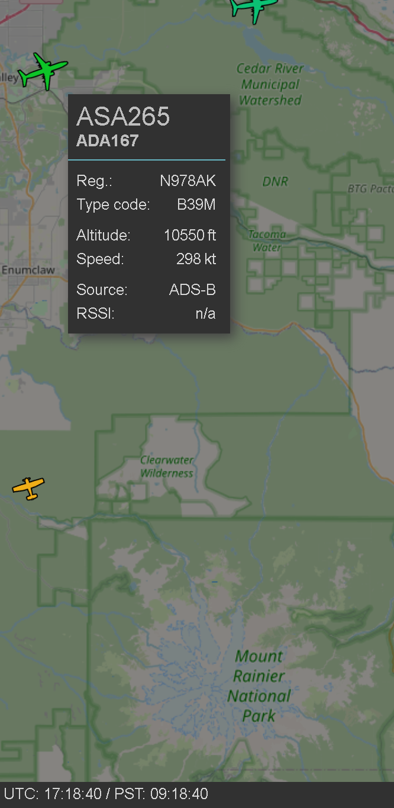
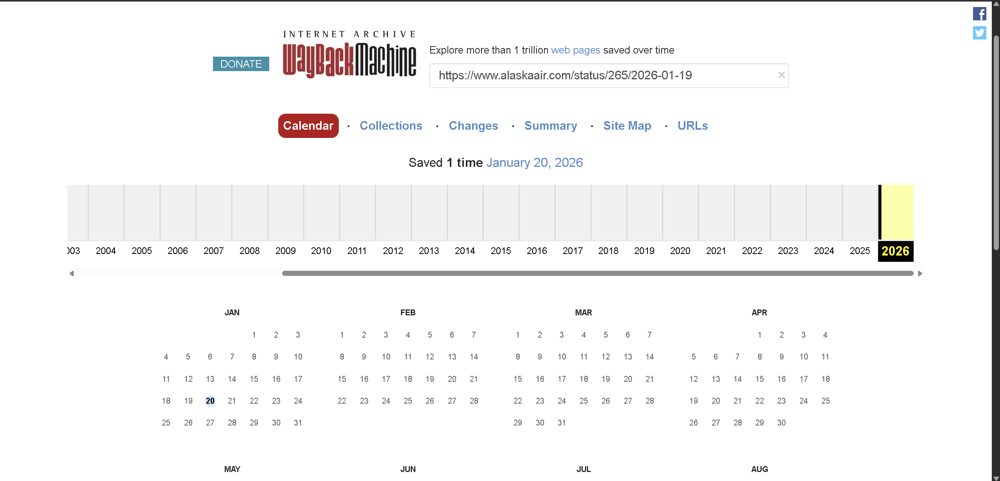
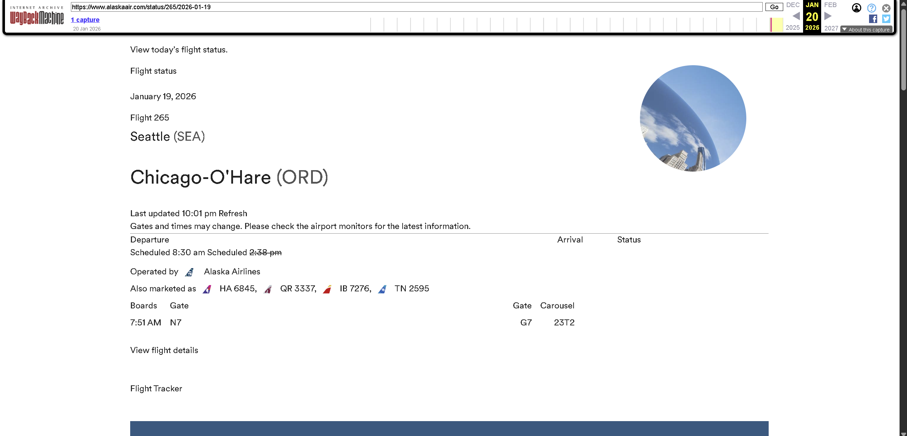

# Eye on the Sky

Category: `rev`

Difficulty: `hard`

Description: 

Part 1:
>Flag format is the flight number (as marketed by the operating airline) (w/ no spaces), followed by ‘-‘, followed by the baggage carousel number. example : `bkctf{DL2949-12C4}`
\
>can you dedeuce where this photo was taken?

Part 2:
>Flag format is the name of the location the image was taken from (ie the location of the photographer). All lower case, remove spaces. Example: `bkctf{goldengatebridge}`

Time spent to solve: ~3 hours.

---

For these challenges, it is easier to start with part 2, then solve part 1. For each challenge, we are given an image (very similar but different between challenges) depicting a mountain from far away.

I'll start by explaining how I found the location for part 2. 

From several google sources and AI overviews, it is easy to conclude that the mountain in this image is Mount Rainier.

Although every source I went to said this was Mount Rainier, I double checked in Google earth. It's also good to note that bkctf was hosted in Washington, so this mountain had a higher liklihood of being the one in the image.

Now that we know this picture is of Mount Rainier, we need to find the locate where this image was taken from. Going back to google earth, if you look at this mountain from the north, you get the same lows and highs as seen from the picture:

After fiddling around in google earth a bit more, I was acurately able to find the approximate location the image was taken from.

After taking this longitude and latitude and plugging it into google maps, the closest location to my google earth coordinates was "Poo Poo Point". Thus, the flag I submitted (and the one that was right) was `bkctf{poopoopoint}`

---

Now that we have the location of part 2, we can be more accurate in our flight decision for part 1.

The metadata of this image reveals when this photo was taken:

`Create Date: 2026:01:19 09:18:43`

Since this photo was taken from the west coast of the US, this time is given in PST. By adding 8 hours we get 17.18.43 UTC. By going to https://globe.adsbexchange.com, you can view all recent flights for free without a trial. By clicking the bottom replay button and plugging in the time 17:18:40 UTC (image is from a little after so we can see its path), we find no planes directly on top of poo poo point, but there was a plane really close to it and on route to get even closer.

If we assume that this is our plane, we need to now form the flag. As a reminder, the flag is made up of both the flight number and baggage carousel number of the given flight. To find this information, we need to gather information about the flight. On adsbexchange, we can gather this information:

We now know the ICAO flight identifier is ASA265. A quick google search shows that the code for the flight number is the AITA airline code + flight number. Since ASA is the ICAO code for Alaska Airlines, and 265 is the flight code, we get the flight number of `AS265`.

We can then plug this information into Alaska Airline's check flight status portal at https://www.alaskaair.com/flightstatus to get the baggage claim carousel. Because Alaska Airlines only stores flight status for the current and previous day, we can use the Wayback Machine to look for archives of the flight. Conviniently, there is an archive of the day we are looking for.

From there, we see the Carousel number is 23T2.

This gives us the completed flag:
`bkctf{AS265-23T2}`

Note: I would normally be unsure about rating this a hard challenge, but for how hard it was for me to get both flags first try, I label it as hard.