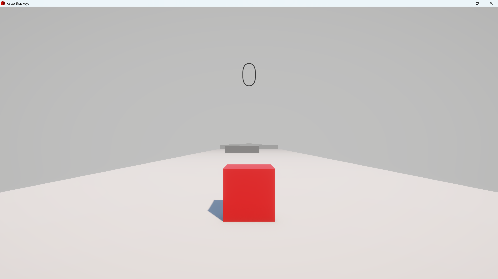
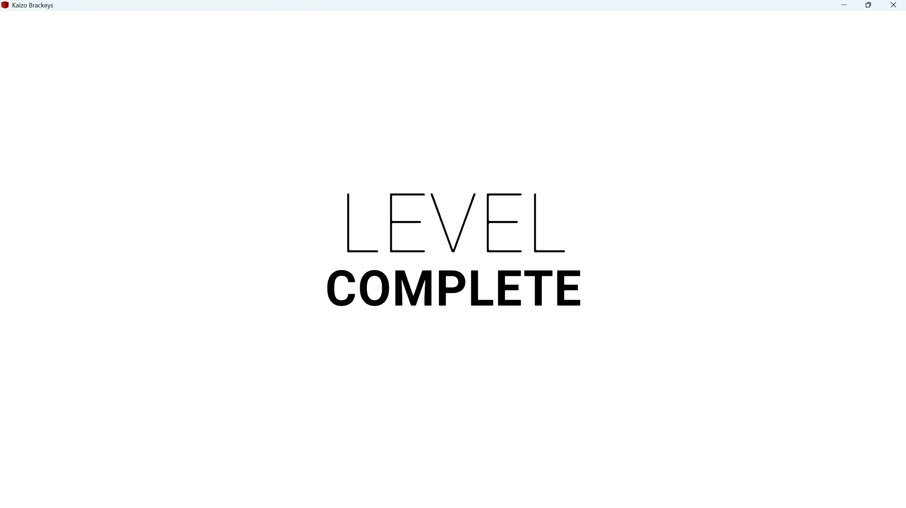
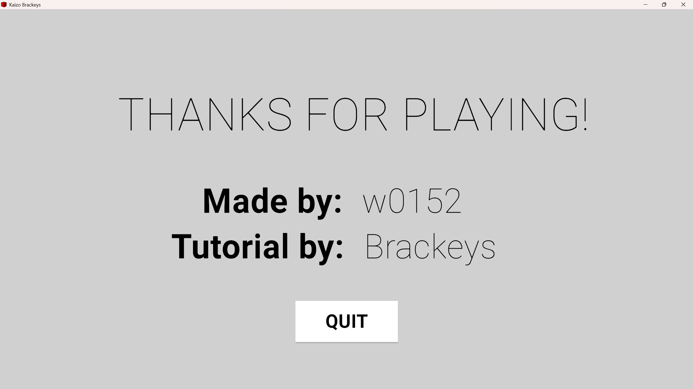
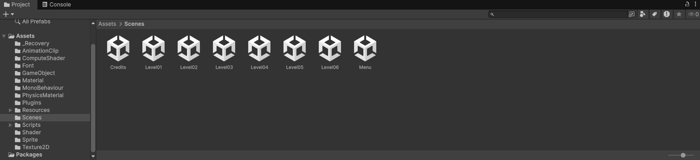
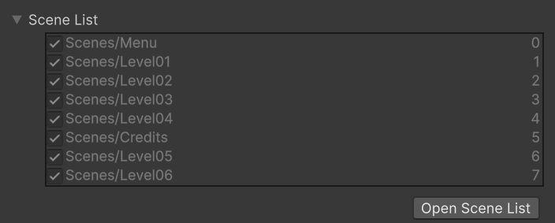
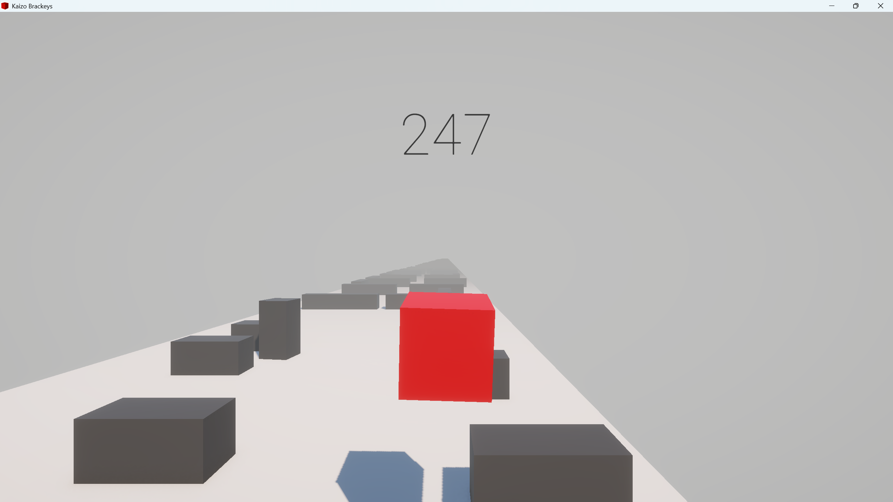
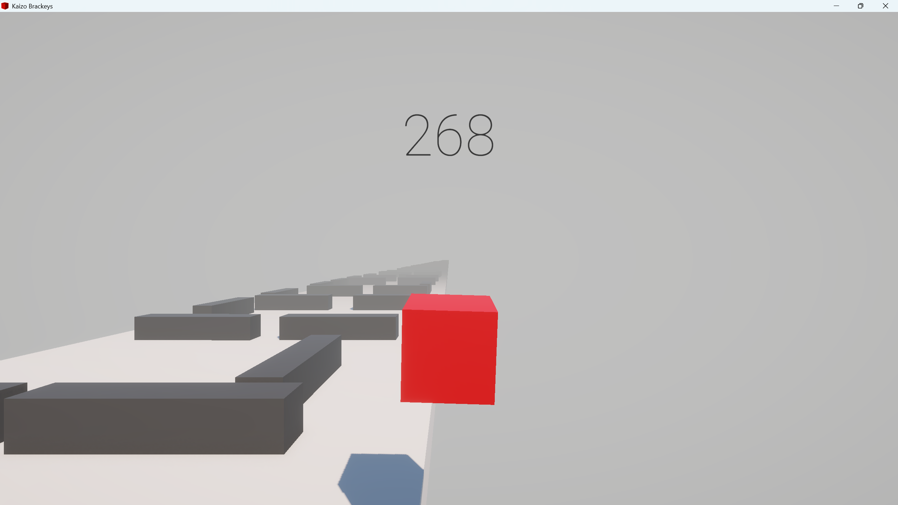

# kaizo brackeys

Category: `rev`

Description:

> only real ones copied those amazing tutorials 
> Note: the flag matches this regex: ^LITCTF\{[A-Z]+(?:_[A-Z]+)*\}$


---

For this flag, we are given the game files for a game called Kaizo Brackeys. Going through the directorys, we can see that there is a file called UnityCrashHandler.exe. This tells us that this game was made with Unity. My first idea was to just run the Kaizo Brackeys.exe file. Running it brings up a menu where you can start the game.


Upon starting the game, you are placed into a game where you must avoid obstacles in order to reach the end. 



The first level is completable by going to the right. Once a level has been beaten, this screen comes up.



We are then brought to the next level, which is impractical to beat without cheats. Doing all of this helps us understand how this game works. If you reach the end of a level, you are brought to the next level. With this in mind, it is viable (*but not true, more on that later) to believe that once we beat the game, we get the flag.

Now to the actual rev part of the problem. We need some way to either let us see what you see when you win, or we need to to make it so getting past levels is a lot easier. A quick google search will tell us that there is no point looking/editing the actual .exe file, because that file only contains information about Unity's compiler. With another google search, we can find out that scripts that the .exe file reads can be found in the `_data/Managed/Assembly-CSharp.dll file`. To read/edit dll files, I like using a neat tool called DnSpy (http://dnspy.org/). 

To get to the scripts, open up DnSpy and go to `File` >> `Open` and then select the `Assembly-CSharp.dll` in `kaizobrackeys-export\kaizobrackeys-export\x86-64\Kaizo Brackeys_Data\Managed`. Once you open this file up, open up the file tree for `Assembly-CSharp/Assembly-CSharp.dll`. You should see a bunch of files like "PE", "Type References", and "References". If you want to know more about what each of these files hold, google.com. For our purposes, we want to open the "_" folder. In there, we can see a whole bunch of scripts that were written specifically for the game. None of these scripts are very long, so I highly suggest you look through all of them and see how this game runs. For the purpose of beating the game, there are a couple names that stand out.

Take a look at Credits, Level Complete, and Player Movement.

In the Credits script, it seems just to be code for a button, and does not have much use to us.
In the Level Complete scipt, it simply tells Unity to go to the next scene. The game will crash if you try and load a scene that doesn't exist, so this is for the best for now.
The Player Movement script, we can see how the player input is recieved and used. This is the script that I edited first. Instead of moving forward at a constantly increasing speed, how about we change the script to allow for wasd movement and a key that moves the player up? This can be done either through googling commands or chatGPT. To edit these scripts, simply right click the Player Movement script and click `Edit Class`. Once you are done editing the file, hit the `compile` button on the bottom right. If you have any issues compiling, try to edit each function and class seperately. 

This is the script I used:

```
using System;
using UnityEngine;

// Token: 0x02000009 RID: 9
public class PlayerMovement : MonoBehaviour
{
	// Token: 0x06000011 RID: 17 RVA: 0x0000327E File Offset: 0x0000147E
	private void Start()
	{
	}

	// Token: 0x06000012 RID: 18 RVA: 0x00003E0C File Offset: 0x0000200C
	private void FixedUpdate()
	{
		if (Input.GetKey("w"))
		{
			this.rb.AddForce(0f, 0f, this.forwardForce * Time.deltaTime);
		}
		if (Input.GetKey("s"))
		{
			this.rb.AddForce(0f, 0f, this.forwardForce * -1f * Time.deltaTime);
		}
		if (Input.GetKey("d"))
		{
			this.rb.AddForce(this.sidewaysForce * Time.deltaTime, 0f, 0f, ForceMode.VelocityChange);
		}
		if (Input.GetKey("a"))
		{
			this.rb.AddForce(-this.sidewaysForce * Time.deltaTime, 0f, 0f, ForceMode.VelocityChange);
		}
		if (Input.GetKey("q"))
		{
			if (!this.wHover)
			{
				this.wHover = true;
				this.wHoverBaseY = this.rb.position.y;
				Vector3 velocity = this.rb.velocity;
				velocity.y = 0f;
				this.rb.velocity = velocity;
				this.rb.useGravity = false;
			}
			float target = this.wHoverBaseY + this.wHoverHeight;
			Vector3 position = this.rb.position;
			position.y = Mathf.MoveTowards(position.y, target, this.wHoverSnapSpeed * Time.fixedDeltaTime);
			this.rb.MovePosition(position);
		}
		else if (this.wHover)
		{
			this.wHover = false;
			this.rb.useGravity = true;
		}
		if (this.rb.position.y < -1f)
		{
			Object.FindAnyObjectByType<GameManager>().EndGame();
		}
	}

	// Token: 0x06000013 RID: 19 RVA: 0x00003280 File Offset: 0x00001480
	public PlayerMovement()
	{
		this.forwardForce = 4000f;
		this.sidewaysForce = 100f;
		base..ctor();
	}

	// Token: 0x04000008 RID: 8
	public Rigidbody rb;

	// Token: 0x04000009 RID: 9
	public float forwardForce;

	// Token: 0x0400000A RID: 10
	public float sidewaysForce;

	// Token: 0x0400000B RID: 11
	private bool wHover;

	// Token: 0x0400000C RID: 12
	private float wHoverBaseY;

	// Token: 0x0400000D RID: 13
	private float wHoverHeight = 3f;

	// Token: 0x0400000E RID: 14
	private float wHoverSnapSpeed = 10f;
}
```

This script lets you move around with wasd controls and lets you move up with q. Once you have compiled your script with no errors, save your file by going to `File` >> `Save Module...`. 

With that, you can now run the kaizo_brackeys.exe file again and breeze through all of the levels until you get to this screen: 



By pressing the exit button, all that happens is the game closes. It seems our previous assumption of the flag being in the credits was wrong. Our best bet now is to find more information about the game, and a good way of doing that is through a software called [Asset Ripper](https://assetripper.github.io/AssetRipper/articles/Downloads.html).

Asset Ripper is built for gathering assets for a Unity .exe filespace and peicing them together to create a file that Unity can read again. To use it, run the AssetRipper.GUI.Free.exe file, then in the pop up open your Kaizo Brackeys_Data file through `File` >> `Open Folder`. Once that is done, you can immediately export it as a Unity Project by going to `Export`, Giving it a folder to print to (It will replace all files in that folder if it is not created in a new folder!), then clicking `Export Unity Project`.

One you have the Unity project exported, you can open that file through [Unity](https://unity.com/download).

> [!IMPORTANT]
>I should note, Asset Ripper only gathers assets, so the full game will not be runnable at this current state. The reason we are doing this is to see files and file structure that is not included in the written scripts.

Once I got the file open in Unity, The first thing I did was look for the credits scene to see if I was missing something. What I saw in the scenes file was interesting.



As I remembered, the game did not seem like it was 6 levels long. We can confirm this by looking at the scene list (`File` >> `Build Profiles`). From there, we can see that the scenes are organised as such:



As we can see, the credits scene is executed early, not allowing us to get to the last two scenes. If we go back to our DnSpy application, we can get around this by simply skipping the credits scene in the `LevelComplete` script we looked at earlier.

```
using System;
using UnityEngine;
using UnityEngine.SceneManagement;

// Token: 0x02000006 RID: 6
public class LevelComplete : MonoBehaviour
{
	// Token: 0x0600000B RID: 11 RVA: 0x00003DB8 File Offset: 0x00001FB8
	public void LoadNextLevel()
	{
		int num = SceneManager.GetActiveScene().buildIndex;
		if (num + 1 == 5)
		{
			num++;
		}
		SceneManager.LoadScene(num + 1);
	}
}
```

Once we save this code, we can run the program, and it successfully skips the credits scene and lets us go on to level 5 and 6. Level 5 you can complete normally, but if you take a close look at Level 6's format, you can tell that after the only 2 tall obstacle, it spells out the flag:





By slowly moving forward and writing down each character, you spell:

`LITCTF{I_HAD_TOO_MUCH_FUN_MAKING_THIS}`
