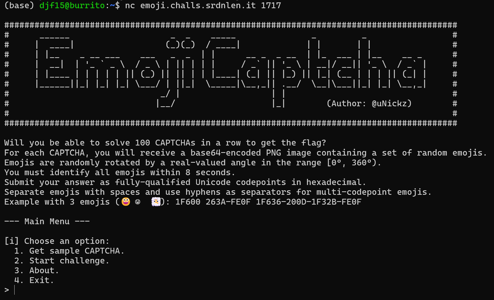
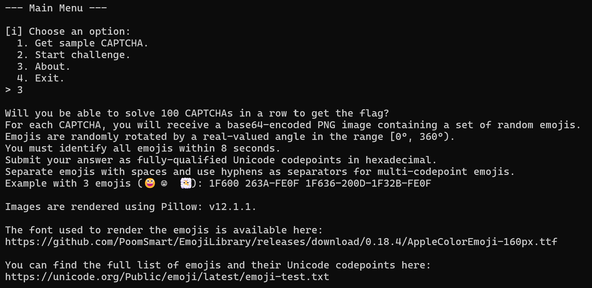
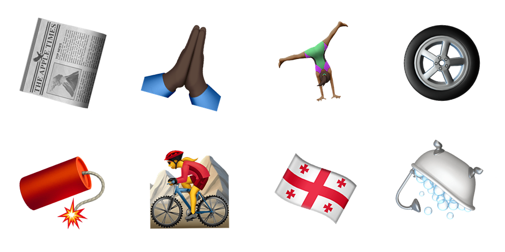
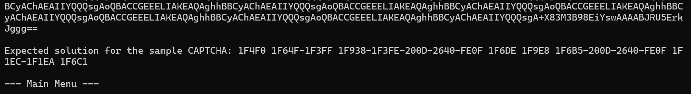
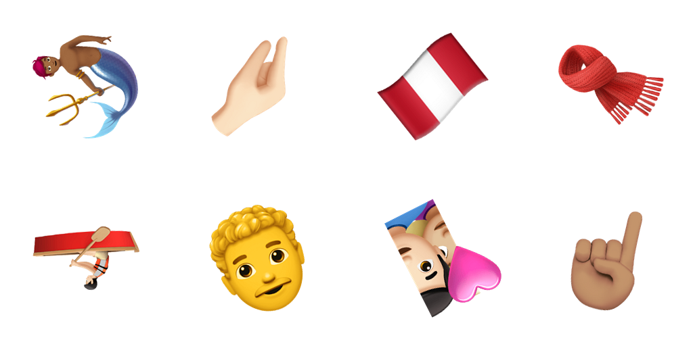
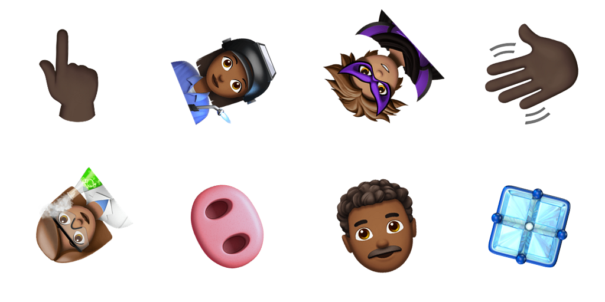
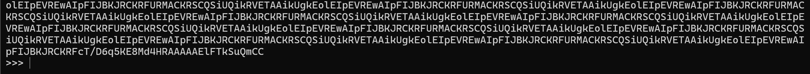
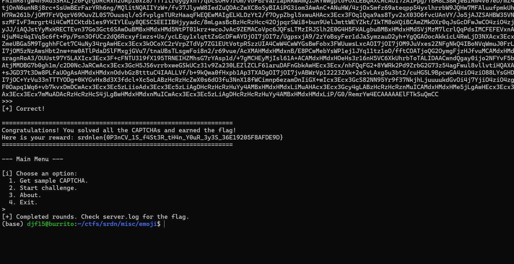
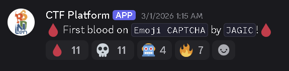

# Emoji CAPTCHA

Category: `misc`

Difficulty: `hard`

Description:

> CAPTCHAs were invented to keep robots out and let humans in. We decided to reverse the rules.
>
>This is a remote challenge, you can connect to the service with: nc emoji.challs.srdnlen.it 1717


Time spent to solve: ~3-4 hours.

---

When we first connect the server, we are prompted with a nice banner and a menu.



We learn more about the challenge when we look at the About page:


Note, this is an updated About page, the earlier page did not include that the images were created through pillow.

Reading through these two pages, we learn how this challenge works. We are given a base64 encoded image with rotated emojis in it, and it's our job to respond to each base64 chunk with the unicode codepoints of each emoji. Looking at the sample image makes this a lot clearer.




With this, we see the intended user input is the emoji unicode from left to right, then the next row left to right.
I was curious for more patterns, so I queried to start the challenge to gather a couple more example images. From these, a pattern emerges:




In every image sent out, we are given a 4x2 array of rotated emojis. This, as we will see later, will significantly simplify the work we need to do.

To solve this challenge, I used an AI model trained to take in a cropped image of a rotated emoji and return the emoji it thought was in the image. Through that, I piped that outputted emoji into its unicode format and sent it back through to the server.

To do this though, I needed 3 things. 
1. A dataset to train the AI off of 

2. A method of training the AI that would lead to the highest success rate 

3. A script to take the AI's output and send it back through the server.  

I'll start with how I got the dataset.
To generate the dataset, I needed thousands of images to train this AI off of. since every outputted image was in a 4x2 format, all I needed the AI to do was to know how to take in one rotate emoji, not the entire image. This greatly reduced the number of images needed to successfully train the AI off of every emoji.

To generate these emojis, I downloaded the emoji-list.txt file referenced in the about section of the challenge. I also downloaded the AppleColorEmoji-160px.ttc font file also mentioned in the about section. With these two files, creating the exact same images as found on the server would be possible.

Then, I used this script to generate thousands of images where every emoji rotated to a random degree several times. Here is that code:

```
#!/usr/bin/env python3
import argparse
import json
import subprocess
import uuid
from pathlib import Path

import numpy as np
from PIL import Image


def parse_emoji_test(emojis_txt: Path, only_fully_qualified: bool = True):
    """
    Parses Unicode emoji-test.txt style file and returns a list of emoji strings.
    """
    out = []
    for line in emojis_txt.read_text(encoding="utf-8", errors="ignore").splitlines():
        line = line.strip()
        if not line or line.startswith("#"):
            continue
        if "#" not in line or ";" not in line:
            continue

        left, right = line.split("#", 1)
        left = left.strip()
        right = right.strip()

        # left: "1F600 ; fully-qualified". Some of the emojis in emoji-list.txt are not in the apple font.
        try:
            _, status = left.split(";", 1)
            status = status.strip()
        except ValueError:
            continue

        if only_fully_qualified and status != "fully-qualified":
            continue

        toks = right.split()
        if not toks:
            continue
        emoji = toks[0]
        out.append(emoji)
    return out


def ensure_labels(emojis):
    labels = {"next_id": len(emojis), "id_to_emoji": {}, "emoji_to_id": {}}
    for i, e in enumerate(emojis):
        labels["id_to_emoji"][str(i)] = e
        labels["emoji_to_id"][e] = i
    return labels


def render_with_pango(emoji: str, out_png: Path, font: str, px: int) -> bool:
    cmd = [
        "pango-view",
        f"--text={emoji}",
        f"--font={font} {px}",
        "--output",
        str(out_png),
        "--no-display",
    ]
    r = subprocess.run(cmd, stdout=subprocess.DEVNULL, stderr=subprocess.DEVNULL)
    return r.returncode == 0 and out_png.exists() and out_png.stat().st_size > 0


def tight_crop_rgba(im: Image.Image, bg_thresh: int = 250, pad_frac: float = 0.08) -> Image.Image:
    """
    Tight-crop around non-white pixels after compositing onto white.
    Input: RGBA
    Output: RGB
    """
    im = im.convert("RGBA")
    rgb = Image.new("RGB", im.size, (255, 255, 255))
    rgb.paste(im, mask=im.split()[-1])  # alpha mask
    arr = np.array(rgb)

    mask = np.any(arr < bg_thresh, axis=2)
    if not mask.any():
        return rgb

    ys, xs = np.where(mask)
    x0, x1 = xs.min(), xs.max() + 1
    y0, y1 = ys.min(), ys.max() + 1

    bw, bh = x1 - x0, y1 - y0
    pad = int(round(max(bw, bh) * pad_frac))
    x0 = max(0, x0 - pad)
    y0 = max(0, y0 - pad)
    x1 = min(arr.shape[1], x1 + pad)
    y1 = min(arr.shape[0], y1 + pad)

    return rgb.crop((x0, y0, x1, y1))


def square_pad_white(im: Image.Image) -> Image.Image:
    im = im.convert("RGB")
    w, h = im.size
    s = max(w, h)
    out = Image.new("RGB", (s, s), (255, 255, 255))
    out.paste(im, ((s - w) // 2, (s - h) // 2))
    return out


def atomic_save_png(im: Image.Image, path: Path) -> None:
    """
    save to a temp file that still ends in .png, then rename.
    """
    path.parent.mkdir(parents=True, exist_ok=True)
    tmp = path.with_suffix(path.suffix + ".tmp")  # e.g. .png.tmp
    im.save(tmp, format="PNG")
    tmp.replace(path)


def main():
    ap = argparse.ArgumentParser()
    ap.add_argument("--emojis_txt", default="emojis.txt")
    ap.add_argument("--out_dir", default="rot_dataset")
    ap.add_argument("--font", default="AppleColorEmoji")
    ap.add_argument("--render_px", type=int, default=160, help="Pango font size used for rendering")
    ap.add_argument("--img_size", type=int, default=128, help="Final training image size")
    ap.add_argument("--per_emoji", type=int, default=20, help="How many rotated samples per emoji")
    ap.add_argument("--min_angle", type=float, default=0.0)
    ap.add_argument("--max_angle", type=float, default=360.0)
    args = ap.parse_args()

    emojis = parse_emoji_test(Path(args.emojis_txt), only_fully_qualified=True)
    print("[*] emojis parsed:", len(emojis))

    out_dir = Path(args.out_dir)
    tmpl_dir = out_dir / "templates"
    crops_dir = out_dir / "crops"
    tmpl_dir.mkdir(parents=True, exist_ok=True)
    crops_dir.mkdir(parents=True, exist_ok=True)

    labels = ensure_labels(emojis)
    (out_dir / "labels.json").write_text(json.dumps(labels, ensure_ascii=False, indent=2), encoding="utf-8")

    rendered = 0
    failed = 0
    for i, e in enumerate(emojis):
        tpath = tmpl_dir / f"{i}.png"
        if tpath.exists() and tpath.stat().st_size > 0:
            rendered += 1
            continue
        ok = render_with_pango(e, tpath, args.font, args.render_px)
        if ok:
            rendered += 1
        else:
            failed += 1
        if (i + 1) % 250 == 0:
            print(f"  templates: {i+1}/{len(emojis)} ok={rendered} fail={failed}")

    print(f"[+] templates done. ok={rendered} fail={failed} (fail means font can't render)")

    # 2) augment rotations into ImageFolder crops/<class_id>/
    made = 0
    skipped = 0
    for i in range(len(emojis)):
        tpath = tmpl_dir / f"{i}.png"
        if not tpath.exists() or tpath.stat().st_size == 0:
            skipped += 1
            continue

        class_dir = crops_dir / str(i)
        class_dir.mkdir(parents=True, exist_ok=True)

        base = Image.open(tpath).convert("RGBA")
        base = tight_crop_rgba(base)

        for k in range(args.per_emoji):
            ang = float(np.random.uniform(args.min_angle, args.max_angle))
            rot = base.rotate(ang, resample=Image.BICUBIC, expand=True, fillcolor=(255, 255, 255))
            rot = square_pad_white(rot)
            rot = rot.resize((args.img_size, args.img_size), Image.LANCZOS)

            out = class_dir / f"{i}_{k:04d}.png"
            atomic_save_png(rot, out)
            made += 1

        if (i + 1) % 250 == 0:
            print(f"  crops for {i+1}/{len(emojis)} (made={made}, skipped={skipped})")

    print(f"[+] dataset ready: {out_dir.resolve()}")
    print(f"    templates/: {rendered} files")
    print(f"    crops/: made={made} images, skipped classes={skipped}")


if __name__ == "__main__":
    main()
```

I ran this with the arguments:
`python3 make_rot_dataset.py --emojis_txt emojis.txt --out_dir rot_dataset --per_emoji 25 --img_size 128 --render_px 160`

This code uses numpy, pillow, and pango-view to create a specified number of rotated emoji images to a specified output directory. I tried using pango-view at first because it has the ability to print images to the command line, but I found training the AI through user input would be far too slow and ended up just using it for rendering the emojis as pngs. Then I used Pillow to make those pngs into their rotated counterpart with the white background. I believe the intended solution was to use pillow entirely, but I found editing my earlier code to be faster than typing out new code.

Something to note. I came across an issue where about 400 or so emojis were in emoji-list.txt but were not in the font file. I assumed they were not included in the generation and skipped them.

---

Once I hade the training dataset, I tested a variety of training code. The one that did the best (and got me the flag) is below:

```
#!/usr/bin/env python3
"""
train_emoji_model4.py

"""

import argparse
import hashlib
import json
from collections import defaultdict
from pathlib import Path

import numpy as np
import torch
from PIL import Image
from torch import nn
from torch.utils.data import DataLoader, Subset, WeightedRandomSampler
from torchvision import transforms
from torchvision.datasets import ImageFolder
from torchvision.models import convnext_tiny, ConvNeXt_Tiny_Weights

try:
    from tqdm import tqdm
except Exception:
    tqdm = None


# parsing

def emoji_to_hex(emoji: str) -> str:
    return "-".join(f"{ord(ch):X}" for ch in emoji)


def parse_emoji_test_meta(emojis_txt: Path, only_fully_qualified: bool = True):
    """
    Parse emoji-test.txt and return:
      meta[emoji] = {
        "codepoints": "1F1FA-1F1F8",
        "status": "fully-qualified",
        "group": "Flags",
        "subgroup": "country-flag",
        "name": "flag: United States"
      }
    """
    meta = {}
    group = None
    subgroup = None

    for raw in emojis_txt.read_text(encoding="utf-8", errors="ignore").splitlines():
        line = raw.strip()
        if not line:
            continue

        if line.startswith("# group:"):
            group = line.split(":", 1)[1].strip()
            continue
        if line.startswith("# subgroup:"):
            subgroup = line.split(":", 1)[1].strip()
            continue
        if line.startswith("#"):
            continue

        # Example line:
        # 1F1FA 1F1F8 ; fully-qualified # 🇺🇸 E2.0 flag: United States
        if "#" not in line or ";" not in line:
            continue

        left, right = line.split("#", 1)
        left = left.strip()
        right = right.strip()

        try:
            cps_part, status = left.split(";", 1)
            status = status.strip()
        except ValueError:
            continue

        if only_fully_qualified and status != "fully-qualified":
            continue

        cps = "-".join([c.strip().upper() for c in cps_part.strip().split() if c.strip()])
        toks = right.split()
        if not toks:
            continue
        emoji = toks[0]
        # toks[1] is "E?.?" version, rest is name
        name = " ".join(toks[2:]) if len(toks) >= 3 else ""

        meta[emoji] = {
            "codepoints": cps,
            "status": status,
            "group": group or "",
            "subgroup": subgroup or "",
            "name": name,
        }

    return meta


def is_flag_emoji(meta_entry: dict) -> bool:
    if not meta_entry:
        return False
    g = (meta_entry.get("group") or "").lower()
    sg = (meta_entry.get("subgroup") or "").lower()
    nm = (meta_entry.get("name") or "").lower()
    return ("flags" in g) or ("flag" in sg) or nm.startswith("flag:")


# ------------------------- template audit -------------------------

def img_hash64(path: Path) -> str:
    """
    Robust-ish hash: decode image -> RGB -> resize -> hash pixels.
    If multiple emojis render identically, they will collide here.
    """
    im = Image.open(path).convert("RGB").resize((64, 64), Image.BILINEAR)
    arr = np.asarray(im, dtype=np.uint8)
    return hashlib.sha1(arr.tobytes()).hexdigest()


def audit_templates(templates_dir: Path, labels: dict, meta: dict, max_print: int = 30):
    """
    Find template collisions (identical rendered image for different emoji IDs).
    """
    id_to_emoji = labels.get("id_to_emoji", {})
    buckets = defaultdict(list)

    for k_str, emoji in id_to_emoji.items():
        p = templates_dir / f"{k_str}.png"
        if not p.exists() or p.stat().st_size == 0:
            continue
        h = img_hash64(p)
        buckets[h].append(int(k_str))

    collisions = {h: ids for h, ids in buckets.items() if len(ids) > 1}
    total_groups = len(collisions)
    total_ids = sum(len(v) for v in collisions.values())

    # collisions involving flags
    flag_groups = 0
    flag_ids = 0
    for ids in collisions.values():
        any_flag = False
        for i in ids:
            e = id_to_emoji.get(str(i), "")
            if is_flag_emoji(meta.get(e, {})):
                any_flag = True
                flag_ids += 1
        if any_flag:
            flag_groups += 1

    print(f"[audit] template collisions: groups={total_groups} total_ids_involved={total_ids}")
    print(f"[audit] collisions involving flags: groups={flag_groups} ids_involved={flag_ids}")

    if total_groups:
        print("[audit] showing up to", max_print, "collision groups:")
        shown = 0
        for h, ids in list(collisions.items())[:max_print]:
            ems = [id_to_emoji.get(str(i), "?") for i in ids]
            names = []
            for e in ems:
                m = meta.get(e, {})
                nm = m.get("name", "")
                names.append(nm[:60])
            print("  ids:", ids[:10], ("..." if len(ids) > 10 else ""))
            print("   em:", ems[:10], ("..." if len(ems) > 10 else ""))
            print(" name:", names[:3], ("..." if len(names) > 3 else ""))
            shown += 1
            if shown >= max_print:
                break

    # write report
    out = templates_dir.parent / "template_collisions.json"
    out.write_text(json.dumps(collisions, indent=2), encoding="utf-8")
    print("[audit] wrote:", out.resolve())


# EMA stuff

class ModelEMA:
    def __init__(self, model: nn.Module, decay: float = 0.999):
        self.decay = decay
        self.ema = self._clone_model(model)

    @staticmethod
    def _clone_model(model: nn.Module) -> nn.Module:
        import copy
        ema = copy.deepcopy(model)
        for p in ema.parameters():
            p.requires_grad_(False)
        ema.eval()
        return ema

    @torch.no_grad()
    def update(self, model: nn.Module):
        d = self.decay
        msd = model.state_dict()
        esd = self.ema.state_dict()
        for k, v in esd.items():
            if k in msd:
                nv = msd[k].detach()
                if v.dtype.is_floating_point:
                    v.mul_(d).add_(nv, alpha=(1.0 - d))
                else:
                    v.copy_(nv)


@torch.no_grad()
def top1_acc(logits: torch.Tensor, y: torch.Tensor) -> float:
    pred = logits.argmax(dim=1)
    return float((pred == y).float().mean().item())


def build_convnext(num_classes: int):
    weights = ConvNeXt_Tiny_Weights.DEFAULT
    model = convnext_tiny(weights=weights)
    # classifier: Sequential(..., Linear)
    in_features = model.classifier[-1].in_features
    model.classifier[-1] = nn.Linear(in_features, num_classes)
    mean, std = weights.transforms().mean, weights.transforms().std
    return model, mean, std


def main():
    ap = argparse.ArgumentParser()
    ap.add_argument("--dataset_dir", default="rot_dataset")
    ap.add_argument("--emojis_txt", default="emojis.txt")
    ap.add_argument("--epochs", type=int, default=25)
    ap.add_argument("--batch", type=int, default=96)
    ap.add_argument("--img_size", type=int, default=160)
    ap.add_argument("--lr", type=float, default=5e-4)
    ap.add_argument("--weight_decay", type=float, default=0.02)
    ap.add_argument("--val_frac", type=float, default=0.02)
    ap.add_argument("--label_smoothing", type=float, default=0.02)
    ap.add_argument("--num_workers", type=int, default=4)
    ap.add_argument("--seed", type=int, default=1337)
    ap.add_argument("--onnx_out", default="emoji_model.onnx")
    ap.add_argument("--ema_decay", type=float, default=0.999)
    ap.add_argument("--boost_flags", type=float, default=1.5, help=">1 oversamples flag examples in training")
    ap.add_argument("--audit_templates", action="store_true")
    args = ap.parse_args()

    ds = Path(args.dataset_dir)
    crops_dir = ds / "crops"
    labels_path = ds / "labels.json"
    templates_dir = ds / "templates"

    if not crops_dir.exists() or not labels_path.exists():
        raise SystemExit("dataset_dir must contain crops/ and labels.json (run make_rot_dataset.py).")

    labels = json.loads(labels_path.read_text(encoding="utf-8"))
    meta = parse_emoji_test_meta(Path(args.emojis_txt), only_fully_qualified=True)

    # Verify codepoint formatting for FLAGS specifically
    id_to_emoji = labels.get("id_to_emoji", {})
    flag_mismatch = 0
    flag_total = 0
    for _, e in id_to_emoji.items():
        m = meta.get(e, {})
        if not is_flag_emoji(m):
            continue
        flag_total += 1
        exp = (m.get("codepoints") or "").upper()
        got = emoji_to_hex(e).upper()
        if exp and got != exp:
            flag_mismatch += 1
    print(f"[flags] emoji_to_hex vs emoji-test: mismatches={flag_mismatch}/{flag_total}")

    if args.audit_templates and templates_dir.exists():
        audit_templates(templates_dir, labels, meta)

    # Build datasets
    # Augmentations: keep them realistic
    # - Rotation 360 w/ white fill
    # - RandomResizedCrop to simulate crop/jitter differences from grid-splitting (im not perfect lol)
    # - tiny blur sometimes 
    model_tmp, mean, std = build_convnext(num_classes=1)
    del model_tmp

    train_tf = transforms.Compose([
        transforms.Resize((args.img_size, args.img_size)),
        transforms.RandomRotation(degrees=360, fill=(255, 255, 255)),
        transforms.RandomResizedCrop(
            args.img_size,
            scale=(0.80, 1.00),
            ratio=(0.92, 1.08),
            antialias=True,
        ),
        transforms.RandomApply([transforms.GaussianBlur(kernel_size=3, sigma=(0.1, 1.0))], p=0.10),
        transforms.ToTensor(),
        transforms.Normalize(mean=mean, std=std),
    ])

    val_tf = transforms.Compose([
        transforms.Resize((args.img_size, args.img_size)),
        transforms.ToTensor(),
        transforms.Normalize(mean=mean, std=std),
    ])

    base_train = ImageFolder(root=str(crops_dir), transform=train_tf)
    base_val = ImageFolder(root=str(crops_dir), transform=val_tf)

    num_classes = len(base_train.classes)
    n = len(base_train)
    val_n = max(1, int(n * args.val_frac))
    train_n = n - val_n

    print("Classes:", num_classes)
    print(f"Total images: {n} | train: {train_n} | val: {val_n}")

    # model class_index -> emoji
    idx_to_emoji = {}
    for folder_name, class_index in base_train.class_to_idx.items():
        em = labels["id_to_emoji"].get(str(folder_name))
        if em is not None:
            idx_to_emoji[str(class_index)] = em

    (ds / "class_index_to_emoji.json").write_text(
        json.dumps(idx_to_emoji, ensure_ascii=False, indent=2),
        encoding="utf-8",
    )
    print("[+] wrote mapping:", (ds / "class_index_to_emoji.json").resolve())

    # Identify flag class indices
    flag_class_idxs = set()
    for class_index_str, emoji in idx_to_emoji.items():
        m = meta.get(emoji, {})
        if is_flag_emoji(m):
            flag_class_idxs.add(int(class_index_str))
    print(f"[flags] classes flagged as flags: {len(flag_class_idxs)}")

    # Split indices deterministically
    g = torch.Generator().manual_seed(args.seed)
    perm = torch.randperm(n, generator=g).tolist()
    val_idx = perm[:val_n]
    train_idx = perm[val_n:]

    train_ds = Subset(base_train, train_idx)
    val_ds = Subset(base_val, val_idx)

    # Weighted sampling to emphasize flags
    sampler = None
    if args.boost_flags and args.boost_flags > 1.0:
        # base_train.samples[i] = (path, class_idx)
        weights = []
        for i in train_idx:
            _, y = base_train.samples[i]
            w = float(args.boost_flags) if y in flag_class_idxs else 1.0
            weights.append(w)
        sampler = WeightedRandomSampler(weights=weights, num_samples=len(weights), replacement=True)
        print(f"[flags] using WeightedRandomSampler boost_flags={args.boost_flags}")

    train_loader = DataLoader(
        train_ds,
        batch_size=args.batch,
        shuffle=(sampler is None),
        sampler=sampler,
        num_workers=args.num_workers,
        pin_memory=True,
        persistent_workers=(args.num_workers > 0),
        drop_last=True,
    )
    val_loader = DataLoader(
        val_ds,
        batch_size=args.batch,
        shuffle=False,
        num_workers=args.num_workers,
        pin_memory=True,
        persistent_workers=(args.num_workers > 0),
    )

    device = torch.device("cuda" if torch.cuda.is_available() else "cpu")
    print("Device:", device)
    if device.type == "cuda":
        torch.backends.cudnn.benchmark = True
        torch.backends.cuda.matmul.allow_tf32 = True
        torch.backends.cudnn.allow_tf32 = True
        try:
            torch.set_float32_matmul_precision("high")
        except Exception:
            pass

    model, _, _ = build_convnext(num_classes=num_classes)
    model.to(device)
    ema = ModelEMA(model, decay=args.ema_decay)

    opt = torch.optim.AdamW(model.parameters(), lr=args.lr, weight_decay=args.weight_decay)
    loss_fn = nn.CrossEntropyLoss(label_smoothing=args.label_smoothing)

    # OneCycleLR tends to work well with AdamW for this kind of classification
    steps_per_epoch = len(train_loader)
    sched = torch.optim.lr_scheduler.OneCycleLR(
        opt,
        max_lr=args.lr,
        epochs=args.epochs,
        steps_per_epoch=steps_per_epoch,
        pct_start=0.10,
        div_factor=10.0,
        final_div_factor=100.0,
    )

    scaler = torch.amp.GradScaler("cuda", enabled=(device.type == "cuda"))

    # fast flag mask lookup: is_flag[class_idx] = 1
    is_flag = np.zeros((num_classes,), dtype=np.uint8)
    for k in flag_class_idxs:
        if 0 <= k < num_classes:
            is_flag[k] = 1

    best_val = 0.0
    best_path = ds / f"best_convnext_{args.img_size}.pt"

    for epoch in range(1, args.epochs + 1):
        model.train()
        total = correct = 0
        total_loss = 0.0

        it = train_loader
        if tqdm is not None:
            it = tqdm(train_loader, desc=f"Epoch {epoch:02d}/{args.epochs}", dynamic_ncols=True)

        for x, y in it:
            x = x.to(device, non_blocking=True)
            y = y.to(device, non_blocking=True)

            opt.zero_grad(set_to_none=True)
            with torch.amp.autocast("cuda", enabled=(device.type == "cuda")):
                logits = model(x)
                loss = loss_fn(logits, y)

            scaler.scale(loss).backward()
            scaler.step(opt)
            scaler.update()
            sched.step()

            ema.update(model)

            bs = x.size(0)
            total_loss += float(loss.item()) * bs
            pred = logits.argmax(dim=1)
            correct += int((pred == y).sum().item())
            total += bs

            if tqdm is not None:
                it.set_postfix(
                    loss=f"{total_loss/max(1,total):.4f}",
                    acc=f"{correct/max(1,total):.4f}",
                    lr=f"{opt.param_groups[0]['lr']:.2e}",
                )

        train_acc = correct / max(1, total)
        train_loss = total_loss / max(1, total)

        # Validate with EMA weights
        ema.ema.to(device)
        ema.ema.eval()

        vtotal = vcorrect = 0
        vflag_total = vflag_correct = 0
        vnon_total = vnon_correct = 0

        is_flag_t = torch.from_numpy(is_flag).to(device)

        with torch.no_grad():
            for x, y in val_loader:
                x = x.to(device, non_blocking=True)
                y = y.to(device, non_blocking=True)

                logits = ema.ema(x)
                pred = logits.argmax(dim=1)
                ok = (pred == y)

                vtotal += y.numel()
                vcorrect += int(ok.sum().item())

                mask_flag = is_flag_t[y].bool()
                if mask_flag.any():
                    vflag_total += int(mask_flag.sum().item())
                    vflag_correct += int(ok[mask_flag].sum().item())

                mask_non = ~mask_flag
                if mask_non.any():
                    vnon_total += int(mask_non.sum().item())
                    vnon_correct += int(ok[mask_non].sum().item())

        val_acc = vcorrect / max(1, vtotal)
        flag_acc = vflag_correct / max(1, vflag_total) if vflag_total else 0.0
        non_acc = vnon_correct / max(1, vnon_total) if vnon_total else 0.0

        print(
            f"Epoch {epoch:02d} | train_loss={train_loss:.4f} train_acc={train_acc:.4f} "
            f"| val_acc={val_acc:.4f} flags_acc={flag_acc:.4f} nonflags_acc={non_acc:.4f}"
        )

        if val_acc >= best_val + 1e-6:
            best_val = val_acc
            torch.save(ema.ema.state_dict(), best_path)

    print("Best val_acc:", best_val)
    print("Saved:", best_path)

    # export
    cpu_model, _, _ = build_convnext(num_classes=num_classes)
    cpu_model.load_state_dict(torch.load(best_path, map_location="cpu"))
    cpu_model.eval()
    cpu_model.to("cpu")

    dummy = torch.randn(8, 3, args.img_size, args.img_size, device="cpu")
    torch.onnx.export(
        cpu_model,
        dummy,
        args.onnx_out,
        input_names=["input"],
        output_names=["logits"],
        dynamic_axes={"input": {0: "batch"}, "logits": {0: "batch"}},
        opset_version=17,
        do_constant_folding=True,
        dynamo=False,
    )
    print("Exported ONNX:", Path(args.onnx_out).resolve())


if __name__ == "__main__":
    main()
```

I ran this with 
`python3 train_emoji_model4.py 
  --dataset_dir rot_dataset 
  --emojis_txt emojis.txt 
  --img_size 160 
  --epochs 25 
  --batch 96 
  --lr 5e-4 
  --val_frac 0.02 
  --label_smoothing 0.02 
  --boost_flags 1.5 
  --audit_templates 
  --onnx_out emoji_model.onnx`

This code uses numpy, pillow, mainly pytorch, and torchvision to train the AI in an optimal way. I tested 4 other torchvision packages but this one specifically seemed to perform the best.

To put it simply, it trains the AI and stores the weights in the emoji_model.onnx file. More complicatedly, it also tracks an Exponential Moving Average of the weights to further adjust during the training process. If you are more curious, look at the code lol.

The astute of you who read the code might have noticed I got a little paranoid with the flags. When I tested the AI model against the test image, it sometimes got the flag wrong, so I added a little more weight to flag chances. Not sure if it made much of a difference with this torchvision package.

---

Lastly, we need a way to take in base64 images and output the unicode answer after the `>>>` line. 



To do this, I used this code:

export_onyx_legacy.py:
```
#!/usr/bin/env python3
import argparse
from pathlib import Path

import torch
from torch import nn
from torchvision.models import mobilenet_v3_small, MobileNet_V3_Small_Weights
from torchvision.datasets import ImageFolder


def main():
    ap = argparse.ArgumentParser()
    ap.add_argument("--dataset_dir", default="rot_dataset")
    ap.add_argument("--weights", default="rot_dataset/best.pt")
    ap.add_argument("--out", default="emoji_model.onnx")
    ap.add_argument("--img_size", type=int, default=128)
    args = ap.parse_args()

    ds = Path(args.dataset_dir)
    crops_dir = ds / "crops"

    full = ImageFolder(root=str(crops_dir))
    num_classes = len(full.classes)
    print("num_classes:", num_classes)

    weights = MobileNet_V3_Small_Weights.DEFAULT
    model = mobilenet_v3_small(weights=weights)
    model.classifier[-1] = nn.Linear(model.classifier[-1].in_features, num_classes)
    model.load_state_dict(torch.load(args.weights, map_location="cpu"))
    model.eval()

    dummy = torch.randn(8, 3, args.img_size, args.img_size, device="cpu")
    torch.onnx.export(
        model,
        dummy,
        args.out,
        input_names=["input"],
        output_names=["logits"],
        dynamic_axes={"input": {0: "batch"}, "logits": {0: "batch"}},
        opset_version=17,
        do_constant_folding=True,
        dynamo=False,  # legacy exporter
    )
    print("wrote:", Path(args.out).resolve())


if __name__ == "__main__":
    main()
```

This code uses torch and torchvision to load the model and run it. This is what I used in my solve.py below to actually communicate with the AI. Its really quite simple, and a quick read might make understanding torchvision make more sense.

solve.py:
```
#!/usr/bin/env python3
import argparse
import base64
import json
import random
import re
import socket
import time
from io import BytesIO
from pathlib import Path

import numpy as np
from PIL import Image
import onnxruntime as ort

# Menu prompt: lines ending with ">"
MENU_PROMPT_RE = re.compile(rb"(?:\n|^)\s*>\s*$|>\s*$", re.M)
CAPTCHA_MARKER_RE = re.compile(rb"Here is your CAPTCHA:\s*\n", re.I)

# Base64 cleaning (strip newlines etc.)
NON_B64_RE = re.compile(rb"[^A-Za-z0-9+/=]+")

# Imagenet normalization
IM_MEAN = np.array([0.485, 0.456, 0.406], dtype=np.float32).reshape(1, 3, 1, 1)
IM_STD  = np.array([0.229, 0.224, 0.225], dtype=np.float32).reshape(1, 3, 1, 1)


def emoji_to_hex(emoji: str) -> str:
    return "-".join(f"{ord(ch):X}" for ch in emoji)


def split_grid_tight_crops(
    img: Image.Image,
    rows: int = 2,
    cols: int = 4,
    bg_thresh: int = 245,
    pad_frac: float = 0.08,
    out_size: int = 128,
):
    img = img.convert("RGB")
    W, H = img.size
    cell_w = W / cols
    cell_h = H / rows
    arr = np.array(img)

    coords, crops = [], []
    for r in range(rows):
        for c in range(cols):
            x0 = int(round(c * cell_w))
            x1 = int(round((c + 1) * cell_w))
            y0 = int(round(r * cell_h))
            y1 = int(round((r + 1) * cell_h))
            cell = arr[y0:y1, x0:x1]

            mask = np.any(cell < bg_thresh, axis=2)
            if mask.any():
                ys, xs = np.where(mask)
                bx0, bx1 = xs.min(), xs.max() + 1
                by0, by1 = ys.min(), ys.max() + 1
            else:
                bx0, by0, bx1, by1 = 0, 0, cell.shape[1], cell.shape[0]

            bw, bh = bx1 - bx0, by1 - by0
            pad = int(round(max(bw, bh) * pad_frac))
            bx0 = max(0, bx0 - pad)
            by0 = max(0, by0 - pad)
            bx1 = min(cell.shape[1], bx1 + pad)
            by1 = min(cell.shape[0], by1 + pad)

            crop = cell[by0:by1, bx0:bx1]

            h, w = crop.shape[:2]
            side = max(h, w)
            top = (side - h) // 2
            bottom = side - h - top
            left = (side - w) // 2
            right = side - w - left
            crop_sq = np.pad(crop, ((top, bottom), (left, right), (0, 0)), constant_values=255)

            crop_img = Image.fromarray(crop_sq).resize((out_size, out_size), Image.LANCZOS)
            coords.append((r, c))
            crops.append(crop_img)

    return coords, crops


def pil_list_to_batch(imgs, img_size: int) -> np.ndarray:
    arrs = []
    for im in imgs:
        if im.size != (img_size, img_size):
            im = im.resize((img_size, img_size), Image.LANCZOS)
        a = np.asarray(im, dtype=np.float32) / 255.0
        a = np.transpose(a, (2, 0, 1))
        arrs.append(a)
    x = np.stack(arrs, axis=0).astype(np.float32)
    x = (x - IM_MEAN) / IM_STD
    return x


class EmojiModel:
    def __init__(
        self,
        onnx_path: str,
        mapping_path: str,
        use_cuda: bool = False,
        img_size: int = 128,
        vote_angles=(0.0, 90.0, 180.0, 270.0),
    ):
        self.mapping = json.loads(Path(mapping_path).read_text(encoding="utf-8"))
        self.img_size = img_size
        self.vote_angles = tuple(float(a) for a in vote_angles)

        providers = ["CPUExecutionProvider"]
        if use_cuda:
            providers = ["CUDAExecutionProvider", "CPUExecutionProvider"]

        so = ort.SessionOptions()
        so.intra_op_num_threads = 0
        so.inter_op_num_threads = 0
        self.sess = ort.InferenceSession(onnx_path, sess_options=so, providers=providers)

        dummy = np.zeros((8, 3, img_size, img_size), dtype=np.float32)
        _ = self.sess.run(["logits"], {"input": dummy})

    def _predict_logits(self, crops: list[Image.Image]) -> np.ndarray:
        batch = pil_list_to_batch(crops, self.img_size)
        return self.sess.run(["logits"], {"input": batch})[0]

    def predict_emojis(self, img: Image.Image) -> list[str]:
        coords, crops = split_grid_tight_crops(img, rows=2, cols=4, out_size=self.img_size)

        if len(self.vote_angles) <= 1:
            logits = self._predict_logits(crops)
            pred = logits.argmax(axis=1).tolist()
        else:
            aug = []
            for crop in crops:
                for ang in self.vote_angles:
                    if ang % 360 == 0:
                        aug.append(crop)
                    else:
                        aug.append(crop.rotate(ang, resample=Image.BICUBIC, expand=False, fillcolor=(255, 255, 255)))

            logits_all = self._predict_logits(aug)
            n = len(crops)
            v = len(self.vote_angles)
            logits_all = logits_all.reshape(n, v, -1).mean(axis=1)
            pred = logits_all.argmax(axis=1).tolist()

        out = []
        for (r, c), k in zip(coords, pred):
            out.append((r, c, self.mapping.get(str(int(k)), "?")))
        out.sort(key=lambda t: (t[0], t[1]))
        return [e for _, _, e in out]


class StreamReader:
    """
    Raw-byte reader that logs EVERYTHING (including base64 blobs).
    """
    def __init__(self, sock: socket.socket, log_path: str, echo: bool = False):
        self.sock = sock
        self.buf = bytearray()
        self.echo = echo
        self.log_fp = open(log_path, "a", encoding="utf-8")

    def close(self):
        try:
            self.log_fp.close()
        except Exception:
            pass

    def _log_bytes(self, b: bytes):
        if not b:
            return
        s = b.decode("utf-8", errors="ignore")
        self.log_fp.write(s)
        self.log_fp.flush()
        if self.echo:
            print(s, end="")

    def _recv(self, timeout: float) -> bytes:
        self.sock.settimeout(timeout)
        try:
            chunk = self.sock.recv(65536)
        except socket.timeout:
            return b""
        if not chunk:
            raise ConnectionError("Server closed connection.")
        return chunk

    def sendline(self, s: str):
        self.sock.sendall((s + "\n").encode("utf-8"))

    def wait_for(self, pattern: re.Pattern, overall_timeout: float):
        """
        Wait until pattern matches current buffer; log all received bytes.
        """
        deadline = time.time() + overall_timeout
        while True:
            if pattern.search(self.buf):
                return
            if time.time() > deadline:
                raise TimeoutError("Timed out waiting for server output.")
            chunk = self._recv(0.5)
            if chunk:
                self.buf.extend(chunk)
                self._log_bytes(chunk)

    def wait_for_captcha_marker(self, overall_timeout: float):
        """
        Wait for marker and consume it; log everything (including any base64 in same recv).
        Leaves buffer starting right after the marker line (base64 begins).
        """
        deadline = time.time() + overall_timeout
        while True:
            m = CAPTCHA_MARKER_RE.search(self.buf)
            if m:
                self.buf = self.buf[m.end():]
                return
            if time.time() > deadline:
                raise TimeoutError("Timed out waiting for CAPTCHA marker.")
            chunk = self._recv(0.5)
            if chunk:
                self.buf.extend(chunk)
                self._log_bytes(chunk)

    def read_base64_until_prompt_stream(self, overall_timeout: float) -> str:
        """
        Read bytes until we see '>>>'. LOGS EVERYTHING while reading.
        Returns cleaned base64.
        """
        deadline = time.time() + overall_timeout
        raw = bytearray()

        if self.buf:
            raw.extend(self.buf)
            self.buf.clear()

        while True:
            idx = raw.find(b">>>")
            if idx != -1:
                b64_block = bytes(raw[:idx])
                leftover = raw[idx + 3:]

                while leftover and leftover[0] in b" \r\n\t":
                    leftover = leftover[1:]
                self.buf.extend(leftover)

                b64_clean = NON_B64_RE.sub(b"", b64_block)
                if not b64_clean:
                    raise ValueError("Empty/invalid base64 CAPTCHA.")
                return b64_clean.decode("ascii", errors="ignore")

            if time.time() > deadline:
                raise TimeoutError("Timed out waiting for CAPTCHA base64/prompt.")

            chunk = self._recv(0.5)
            if chunk:
                raw.extend(chunk)
                self._log_bytes(chunk)

    def drain_until_idle(self, idle_timeout: float = 2.0, max_total: float = 15.0):
        """
        After last answer, keep reading/logging until no data arrives for idle_timeout,
        or until max_total is reached. This captures the FLAG text.
        """
        end_total = time.time() + max_total
        end_idle = time.time() + idle_timeout
        while time.time() < end_total and time.time() < end_idle:
            try:
                chunk = self._recv(0.5)
            except ConnectionError:
                return
            if chunk:
                self.buf.extend(chunk)
                self._log_bytes(chunk)
                end_idle = time.time() + idle_timeout


def connect(host: str, port: int) -> socket.socket:
    s = socket.create_connection((host, port), timeout=10.0)
    try:
        s.setsockopt(socket.IPPROTO_TCP, socket.TCP_NODELAY, 1)
    except Exception:
        pass
    return s


def parse_angles(s: str):
    if not s.strip():
        return (0.0,)
    out = []
    for tok in s.split(","):
        tok = tok.strip()
        if tok:
            out.append(float(tok))
    return tuple(out) if out else (0.0,)


def run_one_session(args, model: EmojiModel) -> bool:
    sock = None
    reader = None
    try:
        sock = connect(args.host, args.port)
        reader = StreamReader(sock, args.log, echo=args.echo)

        reader.wait_for(MENU_PROMPT_RE, overall_timeout=args.menu_timeout)
        reader.buf.clear()
        reader.sendline("2")

        for _round in range(1, args.rounds + 1):
            reader.wait_for_captcha_marker(overall_timeout=args.menu_timeout)
            b64 = reader.read_base64_until_prompt_stream(overall_timeout=args.b64_timeout)

            png_bytes = base64.b64decode(b64)
            img = Image.open(BytesIO(png_bytes)).convert("RGB")

            emojis = model.predict_emojis(img)
            answer = " ".join(emoji_to_hex(e) for e in emojis)
            reader.sendline(answer)

        # IMPORTANT: after the final answer, read the remaining server output (FLAG etc.). I forgot this on one of my winning attempts :( had to win all over again.
        reader.drain_until_idle(idle_timeout=2.0, max_total=20.0)
        return True

    except (ConnectionResetError, ConnectionError, TimeoutError, OSError, ValueError) as e:
        msg = f"\n[!] Session error: {type(e).__name__}: {e}\n"
        if reader:
            reader._log_bytes(msg.encode("utf-8"))
        else:
            print(msg, end="")
        return False

    finally:
        if reader:
            reader.close()
        if sock:
            try:
                sock.close()
            except Exception:
                pass


def main():
    ap = argparse.ArgumentParser()
    ap.add_argument("--host", default="emoji.challs.srdnlen.it")
    ap.add_argument("--port", type=int, default=1717)
    ap.add_argument("--onnx", default="emoji_model.onnx")
    ap.add_argument("--mapping", default="rot_dataset/class_index_to_emoji.json")
    ap.add_argument("--cuda", action="store_true")
    ap.add_argument("--img_size", type=int, default=128)

    ap.add_argument("--vote_angles", default="0,90,180,270",
                    help="comma-separated angles for rotation voting; use '0' to disable voting")
    ap.add_argument("--rounds", type=int, default=100)

    ap.add_argument("--log", default="server.log")
    ap.add_argument("--echo", action="store_true")
    ap.add_argument("--max_retries", type=int, default=20)

    ap.add_argument("--menu_timeout", type=float, default=60.0)
    ap.add_argument("--b64_timeout", type=float, default=30.0)
    args = ap.parse_args()

    angles = parse_angles(args.vote_angles)

    model = EmojiModel(
        args.onnx,
        args.mapping,
        use_cuda=args.cuda,
        img_size=args.img_size,
        vote_angles=angles,
    )

    backoff = 2.0
    for attempt in range(1, args.max_retries + 1):
        ok = run_one_session(args, model)
        if ok:
            print("\n[+] Completed rounds. Check server.log for the flag.")
            return
        sleep_for = backoff + random.uniform(0, 0.5)
        print(f"[!] Reconnecting (attempt {attempt}/{args.max_retries}) after {sleep_for:.2f}s...")
        time.sleep(sleep_for)
        backoff = min(20.0, backoff * 1.5)

    print("[!] Gave up after too many retries.")


if __name__ == "__main__":
    main()
```
This code is run by `python3 solve.py --echo`

I should note that just because you have the same files as me and run the same commands as me does not mean you will 100% get the flag. If you fail, try retraining the AI with better epocs.

This solve.py uses numpy, pillow, the onnx python file mentioned above, and onnxruntime to connect to the server, send 2, read base64, split the image into 8 chunks (1 emoji per chunk), submit the chunks to the AI model, convert the AI model's output to the input the server is looking for, and repeat 100 times. It also reconnects when it fails since its not going to win every round.  This is a huge simplification of what really is going on, but thats the main gist. If you are curious, read the code... I tried to comment the files myself. 

after running solve.py, it took a couple minutes but I do get successful run as seen here:



Flag: `srdnlen{0P3nCV_1S_f4St3R_tH4n_Y0uR_3y3S_36E19205F8AFDE9D}`


